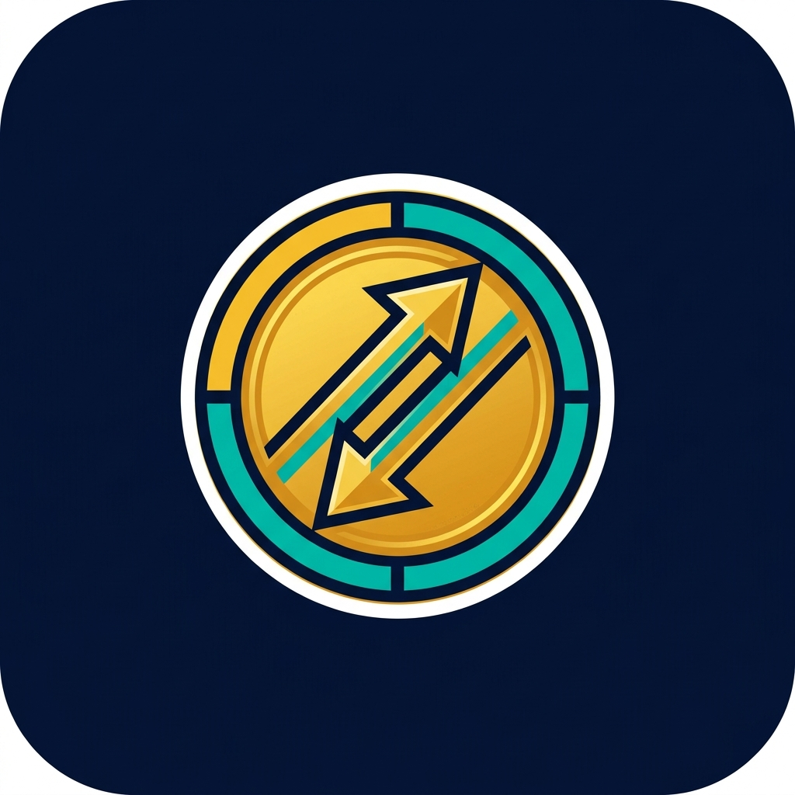

<div align="center">

  

  # KonexMoney

  **Gestion de finances personnelles et dettes intelligentes en Ariary (Ar)**

  [](https://developer.android.com/about/versions/nougat)
  [](https://kotlinlang.org/)
  [](https://developer.android.com/jetpack/compose)
  [](#)

</div>

---

## A propos

**KonexMoney** est une application Android de suivi financier personnelle, pensée pour les utilisateurs malgaches. Elle permet de gérer facilement ses revenus, dépenses et dettes, le tout dans la devise nationale — l'Ariary (Ar).

---

## Fonctionnalités

| Module | Description |
|--------|-------------|
| **Tableau de bord** | Vue d'ensemble du solde actuel, des entrées et sorties du mois en cours, avec des alertes intelligentes pour les remboursements possibles. |
| **Transactions** | Enregistrement des entrées (revenus) et sorties (dépenses) avec catégories (Salaire, Alimentation, Transport, Loisirs, Santé…), modes de paiement (Espèces, Mobile Money, Carte, Virement) et filtres avancés. |
| **Dettes** | Suivi des dettes actives et réglées : créances (« On me doit ») et emprunts (« Je dois »), avec gestion des échéances, reports et motifs. |
| **Statistiques** | Analyse des tendances financières et visualisation des données. |
| **Onboarding** | Création de profil utilisateur avec photo, téléphone, email et date de naissance. |

---

## Technologies

| Technologie | Rôle |
|-------------|------|
| **Kotlin** | Langage principal |
| **Jetpack Compose** | Interface utilisateur moderne et déclarative |
| **Room** | Base de données locale |
| **MVVM** | Architecture logicielle |
| **Android SDK 24+** | Compatibilité Android 7.0 et au-delà |

---

## Installation

### Prérequis

- [Android Studio](https://developer.android.com/studio) (dernière version recommandée)
- JDK 11+

### Étapes

1. **Cloner le dépôt**
   ```bash
   git clone https://github.com/Konex-Boom/Konexmoney.git
   ```

2. **Ouvrir dans Android Studio**
   - Lancer Android Studio → **File > Open** → sélectionner le dossier du projet

3. **Configurer**
   - Supprimer la ligne suivante du fichier `app/build.gradle.kts` :
     ```kotlin
     signingConfig = signingConfigs.getByName("debugConfig")
     ```

4. **Lancer**
   - Connecter un appareil ou démarrer un émulateur
   - Cliquer sur **Run ▶**

---

## Tester l'application

> Téléchargez directement l'APK de test sans compilation :

<div align="center">

  [](https://drive.google.com/file/d/1x9gvonaY8rlYpK-KsbhZihi6f8y4-y8o/view?usp=sharing)

</div>

---

<div align="center">

  Fait avec ❤️ pour la communauté malgache

</div>
